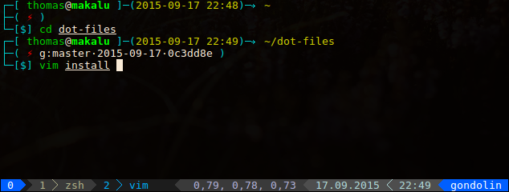
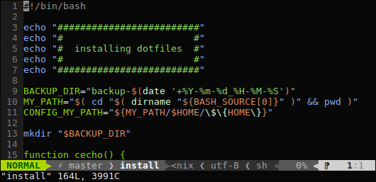

# dot-files

This are my dot-files :-)

Installing them is easy.

- Linux: execute `install`
- Windows: execute `install.bat` (symlinks git and vim config)

## vim

### Use plug

To add plugins simply edit the file `.vim/plug.vim`

Install new plugins:

    :PlugInstall

Update existing plugin:

    :PlugUpdate

[vim-plug on github](https://github.com/junegunn/vim-plug)

## Screenshots

tmux + zsh:  

vim:  

### Videos

- [vim + tmux - OMG!Code (by Nick Nisi)](https://youtu.be/5r6yzFEXajQ)
- [Learning Vim in a Week (by Mike Coutermarsh)](https://youtu.be/_NUO4JEtkDw)
